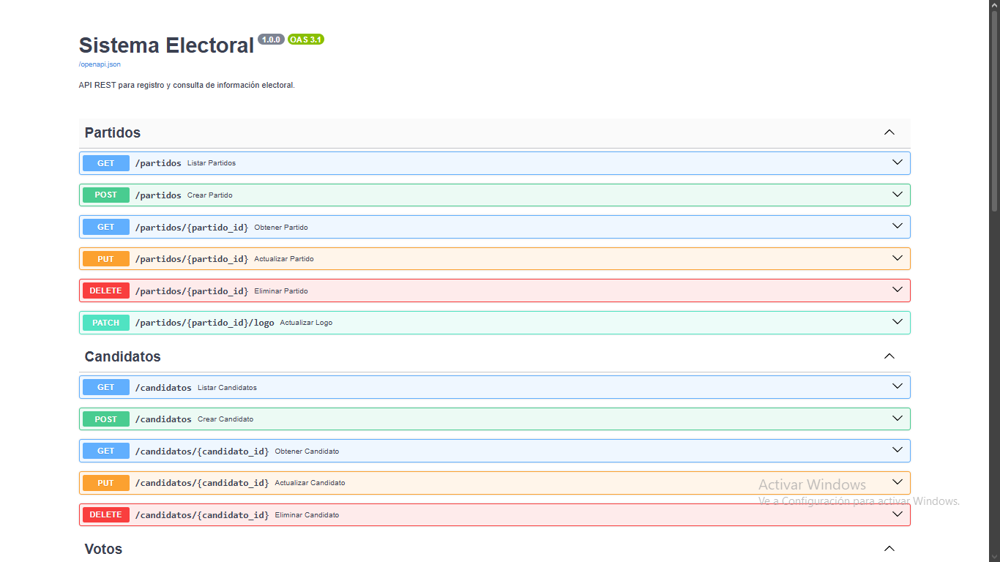
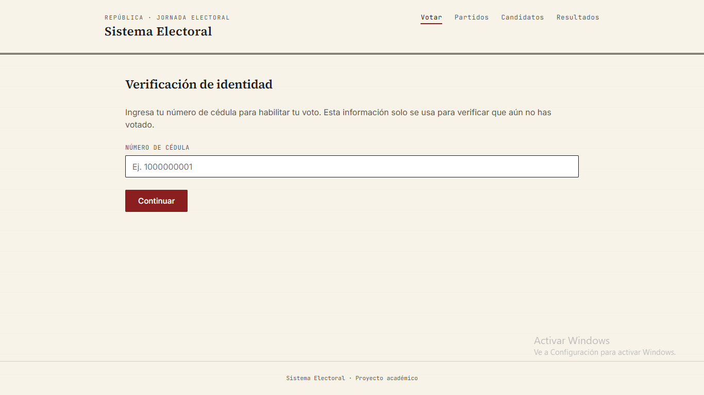
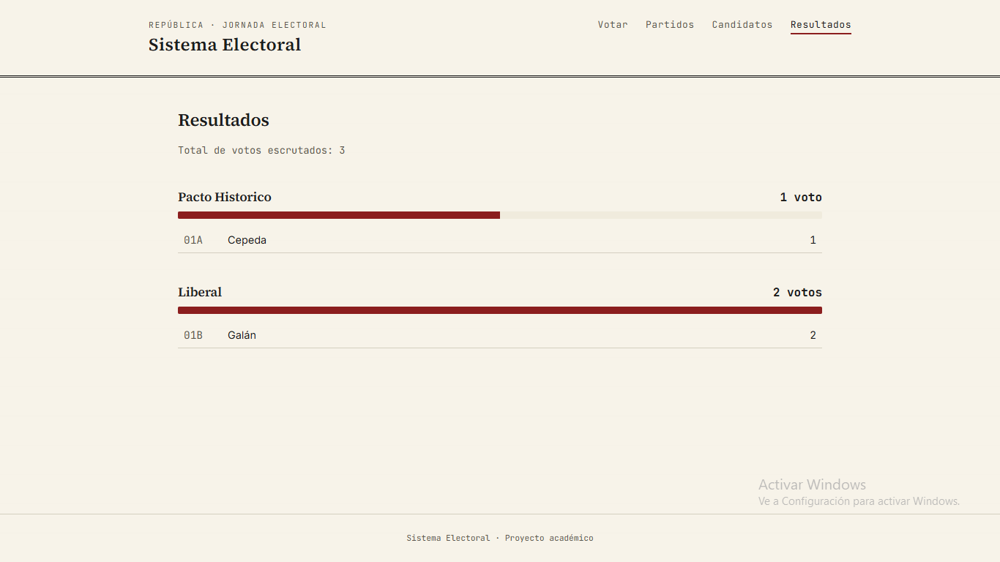

# Sistema Electoral

API REST para el registro y consulta de información electoral: partidos políticos, candidatos y votos, con un flujo de votación que preserva el secreto del voto.

Proyecto académico individual. Backend en FastAPI + PostgreSQL, frontend en React, contenedorizado con Docker para desarrollo local y desplegable en Railway para pruebas en vivo.

## Tabla de contenidos

- [Características](#características)
- [Stack tecnológico](#stack-tecnológico)
- [Arquitectura](#arquitectura)
- [Cómo ejecutar el proyecto](#cómo-ejecutar-el-proyecto)
- [Endpoints principales](#endpoints-principales)
- [Tests](#tests)
- [Documentación adicional](#documentación-adicional)

## Ramas del repositorio

Este proyecto existe en dos versiones, en ramas separadas, para que se pueda verificar tanto el cumplimiento literal del enunciado como las mejoras añadidas sobre él:

| Rama | Qué contiene |
|---|---|
| [`main`](../../tree/main) | **Solución completa.** Incluye todo lo del enunciado base, más el control de identidad del votante (verificación de cédula, bloqueo de doble voto, secreto del voto) como mejora justificada. Esta es la versión desplegada en Railway. |
| [`feature/enunciado-base`](../../tree/feature/enunciado-base) | **Solución ajustada al enunciado literal.** El registro de votos vincula únicamente candidato, partido y momento del voto, sin ningún control de identidad adicional. Útil para verificar el cumplimiento exacto de lo solicitado, sin elementos añadidos. |

La diferencia entre ambas es mínima y está concentrada: en `main`, el parámetro `cedula` de `POST /votos` activa un control de unicidad de voto; en `feature/enunciado-base`, ese parámetro no existe y el endpoint se limita exactamente a lo que el enunciado pide. El resto del sistema (modelo de datos, arquitectura, principios aplicados, frontend) es idéntico en ambas ramas. El razonamiento completo de esta decisión está en [`docs/decisiones_diseno.md`](docs/decisiones_diseno.md#nota-sobre-las-dos-ramas-del-repositorio).

## Características

- **CRUD completo** de partidos políticos y candidatos (las 4 operaciones HTTP: GET, POST, PUT, DELETE).
- **Registro de votos** a candidato específico o directo a partido (voto en blanco/por lista), con validación automática de que el partido del voto coincide con el partido real del candidato.
- **Flujo de verificación de votante** por cédula, con bloqueo de doble voto y expiración por inactividad — sin comprometer el secreto del voto: no existe ninguna relación en la base de datos entre un votante y su voto.
- **Resultados agregados** por partido y candidato en un solo endpoint.
- **Manejo de excepciones centralizado**, con formato de error consistente en toda la API.
- **26 tests automatizados** cubriendo reglas de negocio y garantías estructurales de diseño.

## Stack tecnológico

| Capa | Tecnología | Por qué |
|---|---|---|
| Backend | Python + FastAPI | Documentación interactiva automática (Swagger), validación de datos con Pydantic, tipado estático |
| Base de datos | PostgreSQL | Integridad referencial y transaccional fuerte, necesaria para un dominio electoral |
| ORM | SQLAlchemy | Mapeo objeto-relacional con control fino sobre constraints |
| Frontend | React | Aplicación de página única (SPA) que consume la API vía JSON |
| Contenedores | Docker / Docker Compose | Entorno reproducible para desarrollo local |
| Despliegue | Railway | Demo accesible públicamente sin requerir instalación local |

Ver el razonamiento completo detrás de cada elección en [`docs/decisiones_diseno.md`](docs/decisiones_diseno.md).

## Arquitectura

El backend sigue una arquitectura en capas, donde cada capa tiene una única responsabilidad:

```
Routers (HTTP)  →  Services (reglas de negocio)  →  Repositories (acceso a datos)  →  PostgreSQL
```

- **Routers**: traducen HTTP a llamadas de Service. No contienen lógica de negocio.
- **Services**: contienen las reglas del dominio (ej. derivar el partido de un voto a partir del candidato).
- **Repositories**: únicos responsables de las consultas SQL/ORM.
- **Schemas (Pydantic)**: validan y dan forma a los datos de entrada/salida de la API, separados de los modelos de persistencia (SQLAlchemy).
- **Exceptions**: excepciones de dominio propias, traducidas a respuestas HTTP en un único punto centralizado.

Detalle completo en [`docs/api_specification.md`](docs/api_specification.md) y [`docs/modelo_datos.md`](docs/modelo_datos.md).

## Cómo ejecutar el proyecto

### Opción A: Docker (desarrollo local)

Requisitos: Docker y Docker Compose instalados.

```bash
# 1. Clonar el repositorio
git clone <url-del-repositorio>
cd sistema-electoral

# 2. Crear el archivo de variables de entorno
cp .env.example .env

# 3. Levantar la base de datos y el backend
docker-compose up --build
```

Una vez levantado:
- API y documentación interactiva (Swagger): http://localhost:8000/docs
- Verificación de estado: http://localhost:8000/health

### Opción B: Demo desplegada en Railway

Aplicación completa desplegada y accesible públicamente:
- **Frontend (interfaz de votación)**: https://empathetic-recreation-production-e891.up.railway.app
- **Backend — API y documentación interactiva (Swagger)**: https://prueba-t-cnica-production.up.railway.app/docs
- **Backend — Verificación de estado**: https://prueba-t-cnica-production.up.railway.app/health

### Frontend

```bash
cd frontend
npm install
npm start
```

El frontend espera la API en la URL definida por `REACT_APP_API_URL` (ver `.env.example`), por defecto `http://localhost:8000`.

## Endpoints principales

| Recurso | Operaciones |
|---|---|
| `/partidos` | GET, POST, PUT, DELETE (CRUD completo) |
| `/candidatos` | GET, POST, PUT, DELETE (CRUD completo) |
| `/votos` | GET, POST únicamente — **inmutable por diseño**, ver decisiones de diseño |
| `/votantes/verificar` | POST — verifica/registra una cédula, nunca expone el listado completo |
| `/resultados` | GET — conteo agregado de votos por partido y candidato |

Especificación completa con status codes y formato de errores en [`docs/api_specification.md`](docs/api_specification.md).

## Tests

```bash
docker exec -it electoral_backend python3 -m pytest tests/ -v
```

26 tests cubren reglas de negocio (unicidad compuesta, derivación de partido, bloqueo de doble voto) y garantías estructurales de diseño (ej. que el router de votos no registre `PUT`/`DELETE`).

## Evidencia de funcionamiento

Capturas de la aplicación corriendo en producción (Railway).

**API REST — documentación interactiva (Swagger)**



**Frontend — flujo de votación (verificación de cédula)**



**Frontend — resultados agregados**



## Documentación adicional

- [`docs/modelo_datos.md`](docs/modelo_datos.md) — las 4 tablas, sus columnas, constraints y relaciones.
- [`docs/api_specification.md`](docs/api_specification.md) — todos los endpoints con status codes y manejo de errores.
- [`docs/decisiones_diseno.md`](docs/decisiones_diseno.md) — el razonamiento detrás de cada decisión no obvia del proyecto (por qué Voto es inmutable, por qué no existe relación entre Voto y Votante, por qué la validación de consistencia vive en el backend y no en un trigger, entre otras).
