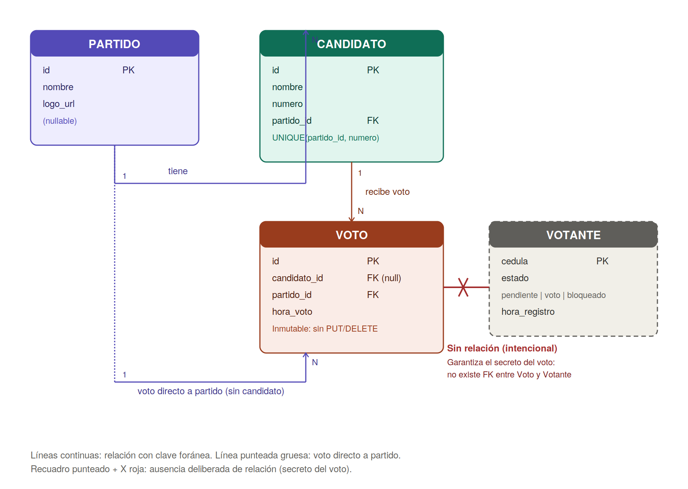

# Modelo de datos

El sistema usa PostgreSQL (relacional) en lugar de una base NoSQL porque el dominio depende fuertemente de relaciones con integridad referencial (candidato → partido, voto → candidato/partido) y de transacciones ACID — un voto no puede perderse a medias ni duplicarse por una falla parcial.

## Diagrama entidad-relación

**Nota importante**: no existe ninguna relación entre `Voto` y `Votante` (marcado explícitamente con la X roja en el diagrama). Esta ausencia es intencional — ver [`decisiones_diseno.md`](decisiones_diseno.md) para el razonamiento completo sobre el secreto del voto.

## Tabla `partidos`

| Columna | Tipo | Constraints | Descripción |
|---|---|---|---|
| `id` | `SERIAL` | `PRIMARY KEY` | Identificador autogenerado |
| `nombre` | `VARCHAR(100)` | `NOT NULL`, `UNIQUE` | No pueden existir dos partidos con el mismo nombre |
| `logo_url` | `VARCHAR(255)` | `NULL` permitido | Ruta al archivo de logo (almacenado en disco, no como binario en la BD); opcional, puede asociarse después de crear el partido |

## Tabla `candidatos`

| Columna | Tipo | Constraints | Descripción |
|---|---|---|---|
| `id` | `SERIAL` | `PRIMARY KEY` | Identificador autogenerado |
| `nombre` | `VARCHAR(150)` | `NOT NULL` | Nombre completo del candidato |
| `numero` | `VARCHAR(10)` | `NOT NULL` | Texto, no entero — soporta formatos como `"01A"` |
| `partido_id` | `INTEGER` | `NOT NULL`, `FK → partidos(id)`, `ON DELETE RESTRICT` | Todo candidato pertenece a un partido |
| — | — | `UNIQUE (partido_id, numero)` | El número es único **solo dentro de su propio partido**: el candidato #3 del Partido A y el #3 del Partido B pueden coexistir |

`ON DELETE RESTRICT` impide borrar un partido que todavía tiene candidatos asociados, protegiendo contra pérdida accidental de información electoral.

## Tabla `votos`

| Columna | Tipo | Constraints | Descripción |
|---|---|---|---|
| `id` | `SERIAL` | `PRIMARY KEY` | Identificador autogenerado |
| `candidato_id` | `INTEGER` | `NULL` permitido, `FK → candidatos(id)`, `ON DELETE RESTRICT` | Opcional: permite votos directos a partido sin candidato específico |
| `partido_id` | `INTEGER` | `NOT NULL`, `FK → partidos(id)`, `ON DELETE RESTRICT` | Siempre presente, incluso cuando hay candidato |
| `hora_voto` | `TIMESTAMP` (con zona horaria) | `NOT NULL`, generado por PostgreSQL al insertar (`server_default`) | Momento exacto del registro del voto |

**Regla de negocio no expresable en SQL puro**: si `candidato_id` no es nulo, `partido_id` debe coincidir con el partido real de ese candidato. Esta regla se garantiza en la capa de Service (`VotoService`), que **deriva** el partido a partir del candidato en lugar de confiar en lo que envíe el cliente — eliminando la inconsistencia por construcción en vez de solo detectarla. Ver el detalle en `decisiones_diseno.md`.

**Inmutabilidad**: la tabla no tiene operaciones de actualización ni borrado expuestas vía API. Un voto, una vez registrado, no se modifica.

## Tabla `votantes`

| Columna | Tipo | Constraints | Descripción |
|---|---|---|---|
| `cedula` | `VARCHAR(20)` | `PRIMARY KEY` | Clave primaria natural (no se usa un id autogenerado) |
| `estado` | `VARCHAR(20)` | `NOT NULL`, default `'pendiente'`, `CHECK (estado IN ('pendiente', 'voto', 'bloqueado'))` | Estado del votante en el flujo de votación |
| `hora_registro` | `TIMESTAMP` (con zona horaria) | `NOT NULL`, generado por PostgreSQL | Usado para calcular expiración por inactividad |

El estado `bloqueado` por expiración **no se persiste de forma activa**: se calcula de forma perezosa en cada consulta, comparando `hora_registro` con el tiempo límite configurado (`TIEMPO_LIMITE_VOTO_MINUTOS`). Ver el razonamiento en `decisiones_diseno.md`.

Esta tabla **nunca se expone completa vía API** — no existe ningún endpoint que liste cédulas. Solo existe `POST /votantes/verificar`, que responde con un booleano y un mensaje, nunca con un listado.
